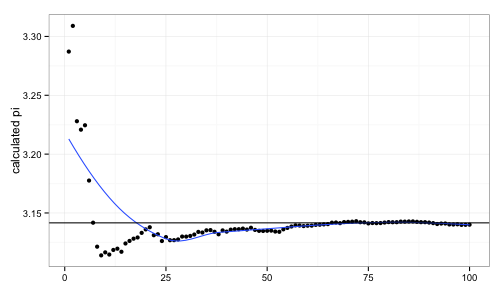

## History of &pi;

- Ancient Greeks defined &pi; 
- Ratio of the circumference of a circle to its diameter. 
- We've found it incredibly important (used everywhere in physics, mathematics &amp; engineering)

## How to Calculate?

```
## [1] 3.141592653589793115998
```
- Irrational number. Impossible to calculate perfectly precisely.
- Many methods to calculate.
- We explore one such method which is easy to understand and fun to demonstrate.
- It's an important example of a much more general, powerful technique, called a Monte Carlo algorithm.

--- .class #id 

## Calculating &pi; (Monte Carlo Method)
- Throw darts randomly at a circular dart board inscribed inside a square frame.
- Darts that don't hit the circle, fall in the remaining portion of the square frame.
- Number of darts falling inside the circle will be proportional to its area.

<hr/>
- $AreaSquare = (2r)^2 = 4 r^2$
- $AreaCircle = \pi r^2$
- $\frac{AreaCircle}{AreaSquare} = \frac{\pi}{4}$
- $\pi = 4 \frac{AreaCircle}{AreaSquare}$
- $\bbox[yellow]{\pi = 4 \frac{Darts Falling In Circle}{Total Number Of Darts}}$


--- .class #id 

## Calculating &pi; (Using shinipi)
- Accuracy of the value of &pi; calculated improves with number of darts.
- Use random numbers to simulate the dart throws.
- Plot the &pi; value calculated against the number of darts thrown.

 

- We can observe the &pi; value converging to the accurate value.
- The [shinypi application](https://tanmaykm.shinyapps.io/shinypi/) allows us to do this interactively.
